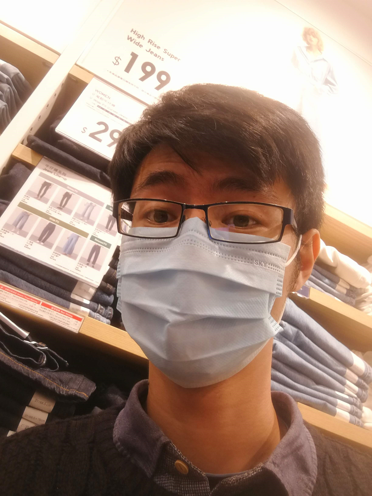

### Hello, I'm Jack L
#### Student Software Developer

I'm an aspiring software developler  with [Founders and Coders](https://www.foundersandcoders.com/)

## Languages and Tools

<table>
    <tr>
        <td width="33%" valign="top">
            
  
                
                
                
                
            

        </td>
    </tr>
</table>

<!-- ## 📊 GitHub Stats -->

<!--  -->

## 🌱 I’m currently learning

- 

<!-- ## 📫 How to reach me -->

<!-- - Email: your.email@example.com -->

<!-- ## ⚡ Fun Fact -->

<!-- [Random fun fact about yourself] -->

<!-- Thanks for visiting my profile! 😄 -->

<!--
**department19/department19** is a ✨ _special_ ✨ repository because its `README.md` (this file) appears on your GitHub profile.

Here are some ideas to get you started:

- 🔭 I’m currently working on ...
- 🌱 I’m currently learning ...
- 👯 I’m looking to collaborate on ...
- 🤔 I’m looking for help with ...
- 💬 Ask me about ...
- 📫 How to reach me: ...
- 😄 Pronouns: ...
- ⚡ Fun fact: ...
-->
